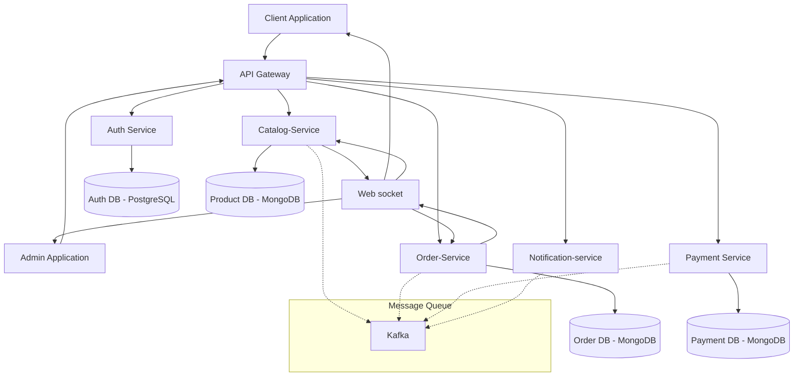

# 🚀 Modern Microservices Architecture

## 📋 Overview
A modern, scalable microservices architecture with independent databases for each service, ensuring complete data isolation and service autonomy.

## 🎥 Service Demonstrations
### Example of a service and how scaling works in k8s

  

## 🏗️ Architecture

## 💾 Database Architecture

| Service | Database Type | Purpose | Scaling Strategy |
|---------|--------------|---------|------------------|
| Auth | PostgreSQL | User profiles, credentials | Sharding |
| Products | MongoDB | Product catalog, inventory | Read replicas |
| Orders | MongoDB | Order processing, history | Sharding |
| Payments | MongoDB | Transaction records | Read replicas |

## ⚡ Key Features
- 🔐 Secure Authentication & Authorization
- 📦 Product Catalog Management
- 🛒 Order Processing
- 💳 Payment Integration
- 📡 Real-time Updates
- 🔄 Service Orchestration
- 🗄️ Independent Databases

## 🛠️ Tech Stack
- **Frontend:** React.js, Redux, Axios
- **Backend:** Node.js, Express.js
- **Databases:** 
  - MongoDB (Auth & Orders)
  - PostgreSQL (Products & Payments)
- **DevOps:** Docker, Kubernetes
- **Message Broker:** Kafka
- **Gateway:** Nginx

## 🚀 Screenshots 

  
  
  
  
  
  
  
  

