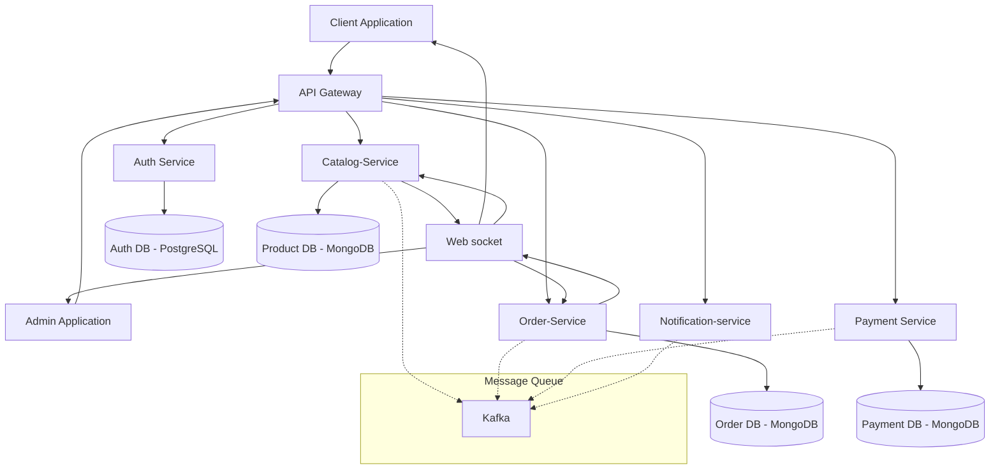

# 🚀 Modern Microservices Architecture

[](https://nodejs.org/)
[](https://reactjs.org/)
[](https://www.docker.com/)

## 📋 Overview
A modern, scalable microservices architecture with independent databases for each service, ensuring complete data isolation and service autonomy.

## 🎥 Service Demonstrations
### System Architecture Overview
[Watch Video on Streamable](https://streamable.com/punaai)


<details>
<summary>View Individual Service Videos</summary>

### Authentication Service
https://github.com/yourusername/project-name/assets/videos/auth-service-demo.mp4
- Separate MongoDB instance for user data
- JWT authentication flow
- Role-based access control

### Product Service
https://github.com/yourusername/project-name/assets/videos/product-service-demo.mp4
- Dedicated PostgreSQL database
- Real-time inventory updates
- Category management

### Order Service
https://github.com/yourusername/project-name/assets/videos/order-service-demo.mp4
- MongoDB instance for order processing
- Order status tracking
- Integration with payment service

### Payment Service
https://github.com/yourusername/project-name/assets/videos/payment-service-demo.mp4
- Separate PostgreSQL for transaction records
- Payment gateway integration
- Secure payment processing
</details>

## 🏗️ Architecture


## 💾 Database Architecture

| Service | Database Type | Purpose | Scaling Strategy |
|---------|--------------|---------|------------------|
| Auth | PostgreSQL | User profiles, credentials | Sharding |
| Products | MongoDB | Product catalog, inventory | Read replicas |
| Orders | MongoDB | Order processing, history | Sharding |
| Payments | MongoDB | Transaction records | Read replicas |

## ⚡ Key Features
- 🔐 Secure Authentication & Authorization
- 📦 Product Catalog Management
- 🛒 Order Processing
- 💳 Payment Integration
- 📡 Real-time Updates
- 🔄 Service Orchestration
- 🗄️ Independent Databases

## 🛠️ Tech Stack
- **Frontend:** React.js, Redux, Axios
- **Backend:** Node.js, Express.js
- **Databases:** 
  - MongoDB (Auth & Orders)
  - PostgreSQL (Products & Payments)
- **DevOps:** Docker, Kubernetes
- **Message Broker:** Kafka
- **Gateway:** Nginx

## 🚀 Quick Start

1. **Clone the Repository**
   ```bash
   git clone https://github.com/yourusername/project-name.git
   cd project-name
   ```

2. **Database Setup**
   ```bash
   # Auth Service Database
   docker run -d --name auth-db \
     -e MONGO_INITDB_ROOT_USERNAME=admin \
     -e MONGO_INITDB_ROOT_PASSWORD=secret \
     mongo

   # Product Service Database
   docker run -d --name product-db \
     -e POSTGRES_USER=admin \
     -e POSTGRES_PASSWORD=secret \
     -e POSTGRES_DB=products \
     postgres

   # Order Service Database
   docker run -d --name order-db \
     -e MONGO_INITDB_ROOT_USERNAME=admin \
     -e MONGO_INITDB_ROOT_PASSWORD=secret \
     mongo

   # Payment Service Database
   docker run -d --name payment-db \
     -e POSTGRES_USER=admin \
     -e POSTGRES_PASSWORD=secret \
     -e POSTGRES_DB=payments \
     postgres
   ```

3. **Environment Setup**
   ```bash
   # Copy and configure environment files for each service
   cp auth-service/.env.example auth-service/.env
   cp product-service/.env.example product-service/.env
   cp order-service/.env.example order-service/.env
   cp payment-service/.env.example payment-service/.env
   ```

4. **Run Services**
   ```bash
   docker-compose up
   ```

## 🔌 Service Endpoints

### Auth Service
```bash
# Base URL: http://localhost:3001/api/auth
POST /register    # User registration
POST /login      # User authentication
GET  /profile    # Get user profile
```

### Product Service
```bash
# Base URL: http://localhost:3002/api/products
GET    /         # List products
POST   /         # Add product
PUT    /:id      # Update product
DELETE /:id      # Remove product
```

### Order Service
```bash
# Base URL: http://localhost:3003/api/orders
POST   /         # Create order
GET    /:id      # Get order details
PATCH  /:id      # Update order status
```

### Payment Service
```bash
# Base URL: http://localhost:3004/api/payments
POST   /process  # Process payment
GET    /status   # Check payment status
```

## 📊 Monitoring
- Each service has its own monitoring dashboard
- Database metrics tracking
- Service health checks
- Performance analytics

## 🧪 Testing
```bash
# Run service-specific tests
cd auth-service && npm test
cd product-service && npm test
cd order-service && npm test
cd payment-service && npm test
```

## 📞 Support
- Create an issue
- Email: your.email@example.com
- Documentation: [Wiki](link-to-wiki)

---
Made with ❤️ by [Your Name]
